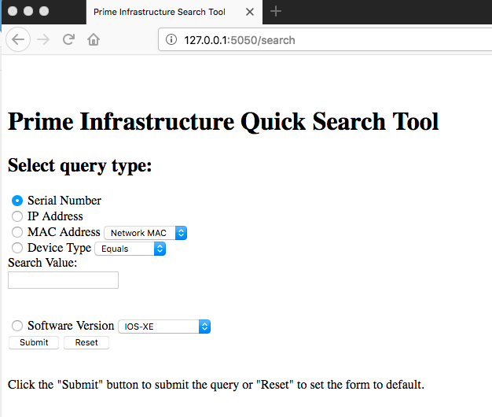
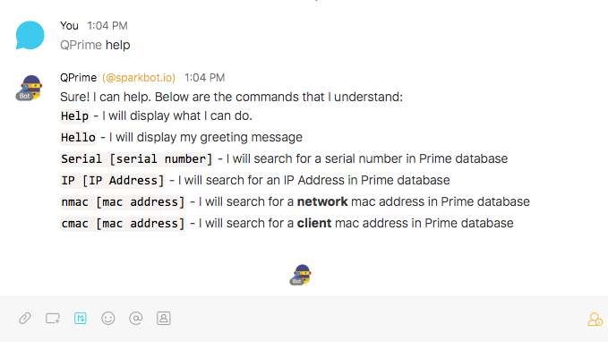

# Prime Infrastructure Inventory Query 


Provides simple interface to query serial number, IP Address or MAC address from the Prime Infrastrucuture Inventory Database.


## Capabilities
* *Query Serial Number*
	* Retrieves serial number for master devices as well as sub-components
* *Query IP Address*
	* Retrieves IP Address attached to device or user
* *Query MAC Address*
	* MAC Address for a network device and user device
* *Query Device Type or Software Version (not available in bot)*
	* Displays report based on query


Three simple interfaces are provided to query the same database; python, web interface as well as a Spark Bot option.


**Figure 1:** *Python Interface*



**Figure 2:** *Web Interface*



**Figure 3:** *Spark Bot Interface*


Provide view of interfaces

A user account with access to the NBI Read User Group is needed to use the API. 
As an administrator, login to Prime and go to **Administration > Users, Roles, & AAA**. 
Create a new user (or edit an existing one) and give it the "NBI Read" group. 
For members of all Northbound InterfaceAPIs: this user group cannot also be members of any other user group. 
This is a special group that lacks access to the Prime Infrastructure user interface.

The project was done using Python 3.6.2.

 
--- 

## Repo Information
* *README.md*
	* This document
* *requirements.txt*
	* Some of the library dependencies used
* *Application Files*
	* /root - main application modules
	* /templates - Flask html template modules


## Application Files in /root
Main application modules

* *startup.cfg*
	* A simple text file used to store and retrieve Prime IP Address, Prime base 64 encoded token, Spark Bot token and options Bot security options.
* *startup.py*
	* Used to set the read IP Address and token into the environment and perform basic connectivity testing
	* os.environ variables are called followed by configuration in startup.cfg file. If none of those are available user is prompted for the variables.
* *getToken.py*
	* Generates base64 encoded token.
	* Can be used to generate the token from the userid and password.
	* Can be used to manually update the token in startup.cfg
* *prime.py*
	* Native Python Interface. Collects user input and displays result to the Python terminal.
* *primeFlask.py*
	* Provides a Web Interface as well as a Spark Bot Interface for user input and display of results.
* *queryMethods.py*
	* This is the main application module that makes the call to Prime Infrastructure and returns the results to be displayed.

## Application files in /templates folder
Files used for Flask html template modules.

* *form_submit.html*
	* The html to collect user input and search query variables.
* *device_action.html*
	* Display the results from Prime Infrastructure query. Simple query.
* *device_action_list.html*
	* Display the results from Prime Infrastructure query that returns an extended list.


## Placing Environment Variables in the OS
In some environments (especially during development) it may be desirable to set some variables outside of the scripting environment.

This can be done by adding the following commands from the same window (shell) that you call the Python intepreter from.

### ***MAC OSx***
```
export primeServer=198.18.16.1
export primeAuthToken=aXFlX2FwzSqqf8FGSXNzRVBy
export sparkBotToken=aXFlX2FwzSqqf8FGSXNzRVBy
```

### ***Windows***
```
set primeServer=198.18.16.1
set primeAuthToken=aXFlX2FwzSqqf8FGSXNzRVBy
set sparkBotToken=aXFlX2FwzSqqf8FGSXNzRVBy
```


	
 